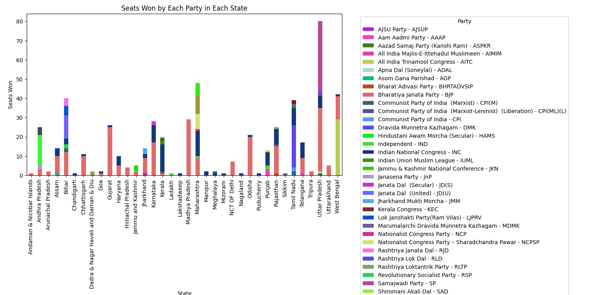
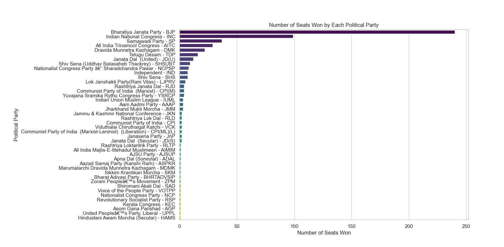
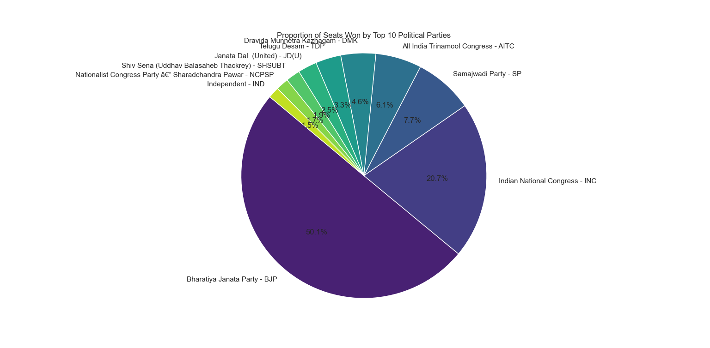
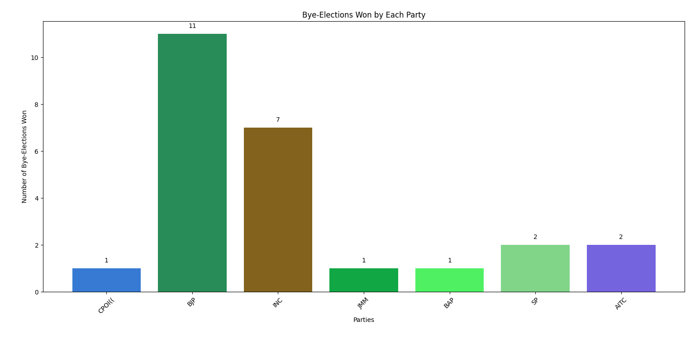

# 2024 Lok Sabha Elections Data Analysis

## Overview
This project focuses on web scraping data from the 2024 Lok Sabha Elections results on [Election Commission of India's website](https://results.eci.gov.in/) using Scrapy. The scraped data is analyzed using Matplotlib, Seaborn, and Pandas to derive insights about the election outcomes.

## Table of Contents
- [Project Title (e.g., 2024 Lok Sabha Elections Data Analysis)](#2024-lok-sabha-elections-data-analysis)
  - [Overview](#overview)
  - [Table of Contents](#table-of-contents)
  - [Project Structure](#project-structure)
  - [Setup Instructions](#setup-instructions)
  - [Data Analysis Insights](#data-analysis-insights)

## Project Structure
The project directory structure is organized as follows:

## Setup Instructions
To set up the project locally, follow these steps:

1. **Clone the repository:**
   ```bash
   git clone https://github.com/your/repository.git
   cd repository-folder

2. **Install the dependencies:**
   ```bash
   pip install -r requirements.txt

## Data Analysis Insights
### Charts
1. **Seats won by each Party in each State**



2. **Total Number of seatc won by each Party**



3. **Proportion of seats won by the Top 10 Parties**


 
4. **Bye-Elections won by each Party**



